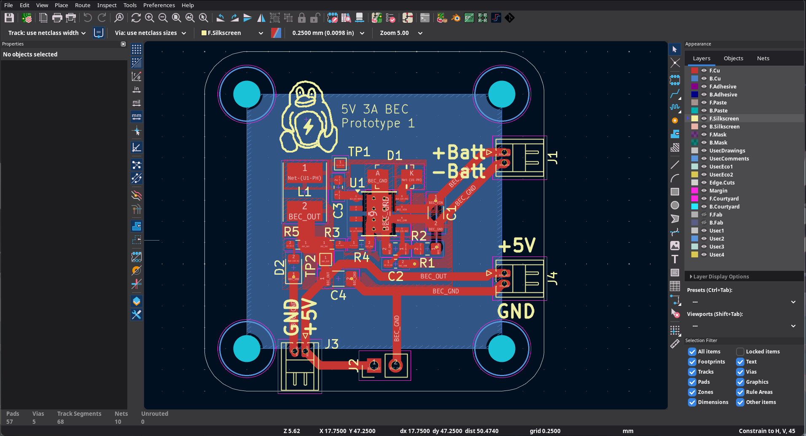
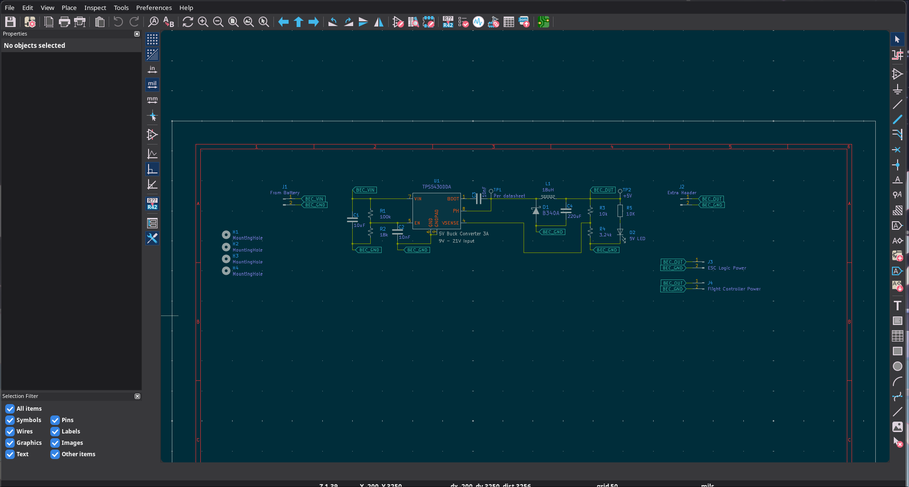
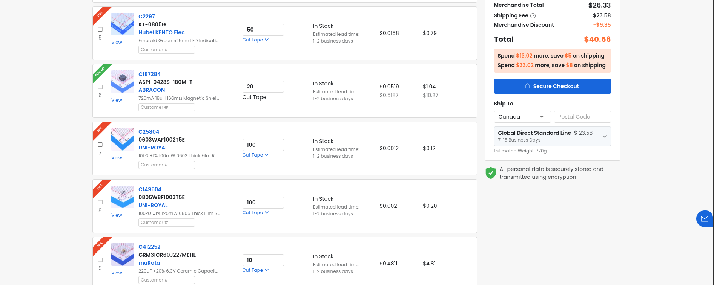

# customBEC
A custom made battery elimination circuit.
output 5V 3A 15W.
30x30 size for 5" drones and other projects that need 5v supply

## How to use
there is a +batt and -batt, connect battery there
there is +5V and GND for output

# Pictures

blender render:

PCB:

schematic:

# Prices

# LCSC

